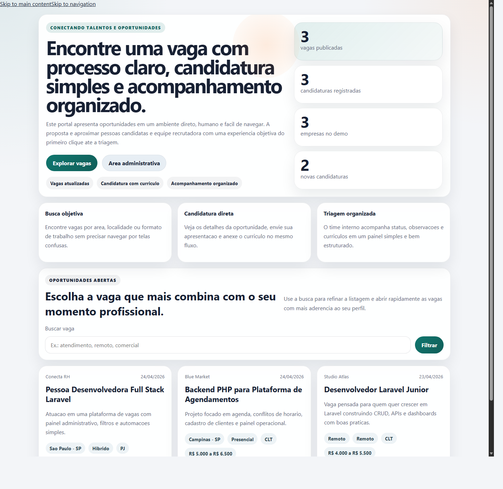
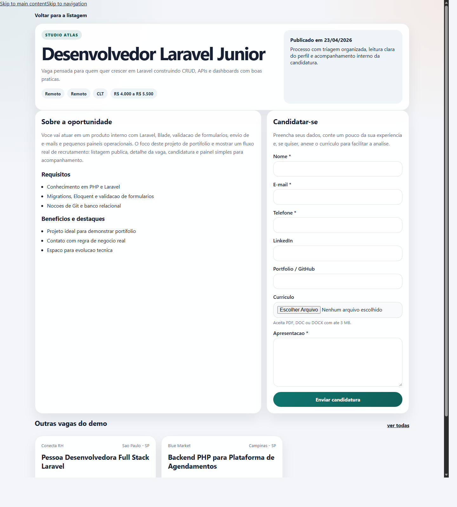
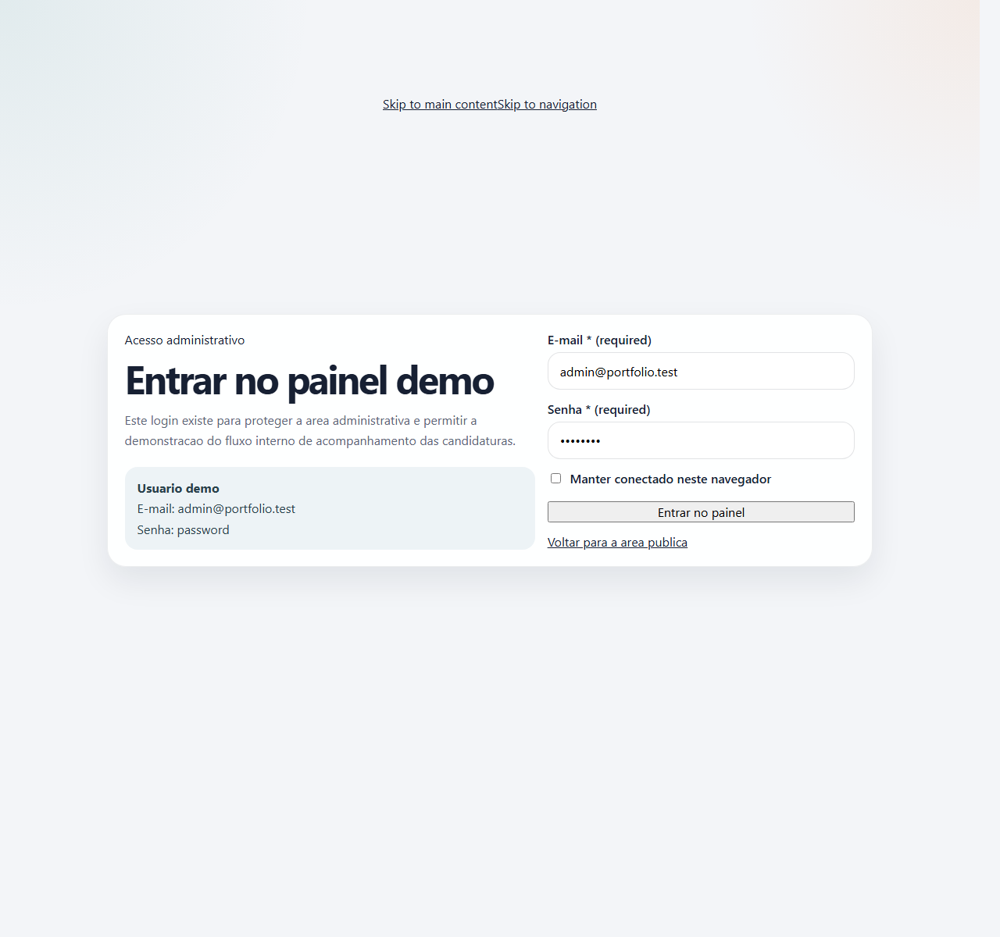

# Atlas Recruta

Projeto Laravel de portfólio modelado como uma plataforma enxuta de recrutamento tech.

A ideia aqui nao e mostrar um sistema gigante, e sim um fluxo pequeno com contexto real: publicacao de vagas, candidatura publica, painel autenticado para triagem e armazenamento protegido de curriculos. O projeto foi pensado para ser facil de explicar em entrevista e, ao mesmo tempo, demonstrar organizacao tecnica.

## Preview





## O que o projeto cobre

- area publica com listagem e busca de vagas
- detalhe da oportunidade com candidatura no mesmo fluxo
- upload opcional de curriculo em `pdf`, `doc` ou `docx`
- painel autenticado para operacao interna
- CRUD de vagas
- ficha da candidatura com status e observacoes
- armazenamento privado para arquivos enviados
- testes de feature cobrindo os fluxos principais
- AdminLTE na area administrativa

## Contexto do produto

A Atlas Recruta foi desenhada como uma plataforma focada em vagas de tecnologia. O portal publico conversa com pessoas candidatas de forma objetiva, enquanto o painel interno atende a rotina do time que publica vagas e faz triagem de perfis.

## Rotas principais

- `/` portal de vagas
- `/vagas/{slug}` detalhe da vaga
- `/login` acesso interno
- `/painel` painel administrativo

## Credenciais tecnicas locais

Depois de rodar os seeders:

- e-mail: `admin@atlasrecruta.test`
- senha: `password`

## Stack

- PHP `8.3`
- Laravel `13`
- Blade
- Eloquent ORM
- SQLite para ambiente local rapido
- Vite
- AdminLTE
- Bootstrap Icons
- PHPUnit

## Como executar localmente

### 1. Instalar dependencias

```bash
composer install
npm install
```

### 2. Preparar ambiente

```bash
copy .env.example .env
php artisan key:generate
```

Se quiser manter o setup simples, o projeto ja acompanha `database/database.sqlite`.

### 3. Rodar migrations e seeders

```bash
php artisan migrate
php artisan db:seed
```

### 4. Subir o projeto

```bash
php artisan serve
```

Em outro terminal, para desenvolvimento front-end:

```bash
npm run dev
```

## Validacao

```bash
php artisan test
php artisan view:cache
npm run build
```

## Dados de exemplo

O seeder cria:

- contas tecnicas locais para acesso interno
- vagas publicadas no nicho de tecnologia
- candidaturas de exemplo para a triagem

Arquivo principal:

- [database/seeders/RecruitmentSeeder.php](database/seeders/RecruitmentSeeder.php)

## Estrutura principal

- `app/Http/Controllers` fluxo publico, auth e painel
- `app/Http/Requests` validacoes de formulario
- `app/Models` entidades principais
- `app/Services/RecruitmentDashboardService.php` resumo do painel
- `database/migrations` estrutura do banco
- `database/seeders` dados locais de apoio
- `resources/views/portfolio` telas publicas e administrativas
- `resources/css/views/portfolio` estilos por tela
- `resources/js/views/portfolio` scripts especificos por tela
- `tests/Feature/RecruitmentFlowTest.php` cobertura principal dos fluxos

## O que vale destacar em entrevista

- separacao clara entre portal publico e retaguarda
- uso de `FormRequest` para validacao
- relacao entre vagas e candidaturas com Eloquent
- upload de curriculo com acesso protegido
- CRUD completo de vagas no painel
- testes cobrindo comportamento de negocio

## Proximos passos possiveis

- notificacao por e-mail ao receber candidatura
- filtros internos por status
- paginacao das candidaturas
- dashboard com graficos simples
- permissao por perfil

## Licenca

Projeto usado para estudo, apresentacao e demonstracao de portfolio.
